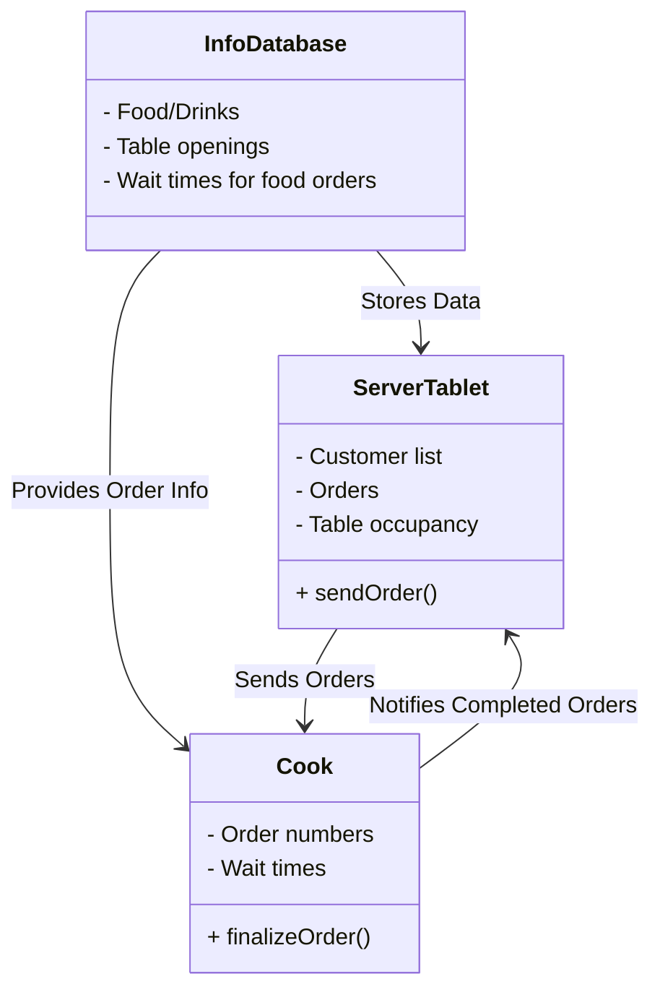

```mermaid

classDiagram
    class InfoDatabase {
        - Food/Drinks
        - Table openings
        - Wait times for food orders
    }
    
    class ServerTablet {
        - Customer list
        - Orders
        - Table occupancy
        + sendOrder()
    }
    
    class Cook {
        - Order numbers
        - Wait times
        + finalizeOrder()
    }

    InfoDatabase --> ServerTablet : Stores Data
    InfoDatabase --> Cook : Provides Order Info
    ServerTablet --> Cook : Sends Orders
    Cook --> ServerTablet : Notifies Completed Orders

```
